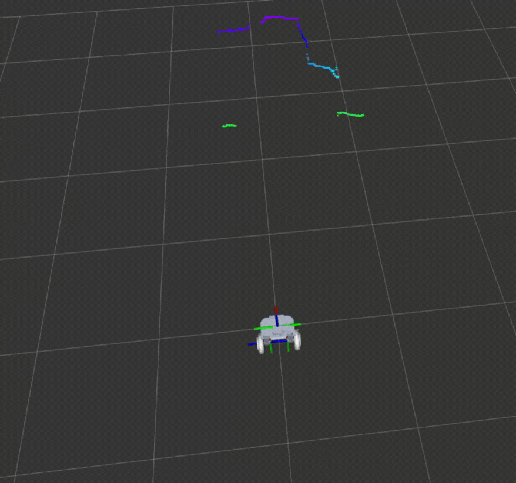

# ros2_ps5_stereo

ROS 2 package for using the PlayStation 5 HD Camera as a stereo vision sensor.  
It provides left/right camera streams, performs image rectification, stereo disparity computation, and optionally generates point clouds or 2D laser scans.

This package is part of the larger project [HoverRobot_ProyectoFinal](https://github.com/patoGarces/HoverRobot_ProyectoFinal).

### Example PointCloud


### Example LaserScan


---

## 🚀 Features
- Automatic PS5 Camera firmware loading – the node handles firmware upload at startup, no manual intervention required.
- Stereo capture from the PS5 HD Camera.
- ROS 2 image pipeline integration:
  - Left/Right raw images
  - Rectified images
  - Stereo disparity
  - PointCloud2 (optional)
  - LaserScan (optional)
- Configurable resolution and frame rate.
- Region of Interest (ROI) cropping support.

---

## 📦 Installation

1. Clone into your ROS 2 workspace:
   cd ~/ros2_ws/src
   git clone https://github.com/yourusername/ros2_ps5_stereo.git

2. Build the package:
   cd ~/ros2_ws
   colcon build --packages-select ros2_ps5_stereo
   source install/setup.bash

3. Check that the PS5 camera is detected:
   lsusb | grep Sony

---
## ▶️ Usage

Launch the stereo processing pipeline:

   - ros2 launch ros2_ps5_stereo ros2_ps5_stereo_launch.py

If you want to visualize the robot model as part of the HoverRobot project:

   - ros2 launch hoverrobot_description display.launch.py

This will start:
- camera_node (stereo capture)
- rectify_left / rectify_right (rectification via image_proc)
- disparity_node (stereo disparity via stereo_image_proc)
- disparity_to_laserscan (convert disparity to 2D LaserScan)
- Static TF publishers for pointcloud/laserscan frames

Psss: The camera_node automatically uploads the required PS5 camera firmware on startup, so you do not need to run any separate firmware loader.

You can enable or disable the point cloud nodes by editing the launch file (currently commented out).

---

## 📡 Published Topics

/left/image_raw -> sensor_msgs/msg/Image  
/left/camera_info -> sensor_msgs/msg/CameraInfo  
/left/image_rect -> sensor_msgs/msg/Image  

/right/image_raw -> sensor_msgs/msg/Image  
/right/camera_info -> sensor_msgs/msg/CameraInfo  
/right/image_rect -> sensor_msgs/msg/Image  

/disparity -> stereo_msgs/msg/DisparityImage  
/points2 -> sensor_msgs/msg/PointCloud2 (if point_cloud_node enabled)  
/scan -> sensor_msgs/msg/LaserScan (from disparity-to-laserscan)  

---

## ⚙️ Camera Parameters and FPS Optimization

### `camera_resolution`
- Integer value corresponding to one of the available presets:
  - 0 → RES_640x480_DOWNSAMPLED_8FPS
  - 1 → RES_640x480_DOWNSAMPLED_30FPS
  - 2 → RES_640x480_DOWNSAMPLED_60FPS
  - 3 → RES_1280x800_8FPS
  - 4 → RES_1280x800_30FPS
  - 5 → RES_1280x800_60FPS
  - 6 → RES_1920x1080_8FPS
  - 7 → RES_1920x1080_30FPS

### `roi_height`
- Crops the height of the camera frames before publishing.
- By reducing `roi_height`, the camera processes fewer lines per frame, which **increases the achievable FPS**.
- Example usage in your launch file:
  ```
  camera_node = Node(
      package='ros2_ps5_stereo',
      executable='camera_node',
      name='camera_node',
      parameters=[{
          'camera_resolution': Resolutions.RES_640x480_DOWNSAMPLED_60FPS.value,
          'roi_height': 50   # Only process 50 rows of pixels vertically
      }]
  )
  ```
- Tip: Start with the full frame (`roi_height` = full height of the selected resolution) and gradually decrease until you reach the desired FPS for your application.
- Warning: Cropping too much can affect stereo matching quality and downstream processing (disparity, pointcloud).

---

## ⚙️ Other Node Parameters

disparity_node (from stereo_image_proc)
- sgbm_mode (int, default: 0)
- prefilter_size
- prefilter_cap
- correlation_window_size
- disparity_range
- other tuning parameters (see stereo_image_proc docs)

disparity_to_laserscan
- scan_height (default: 1)
- range_min (default: 0.1)
- range_max (default: 5.0)

---

## 📷 Visualization

RViz2:
- Image -> /left/image_rect or /right/image_rect
- PointCloud2 -> /points2 (if enabled)
- LaserScan -> /scan

---

## 🛠 Dependencies
- ROS 2 Jazzy
- cv_bridge
- image_transport
- stereo_image_proc
- image_proc
- tf2_ros

Ubuntu install:
   sudo apt install ros-jazzy-cv-bridge ros-jazzy-image-transport \
                    ros-jazzy-stereo-image-proc ros-jazzy-image-proc \
                    ros-jazzy-tf2-ros

---

## 📄 License
MIT

---

## ✨ Contributing
Pull requests are welcome! Please open an issue for bug reports or feature requests.
